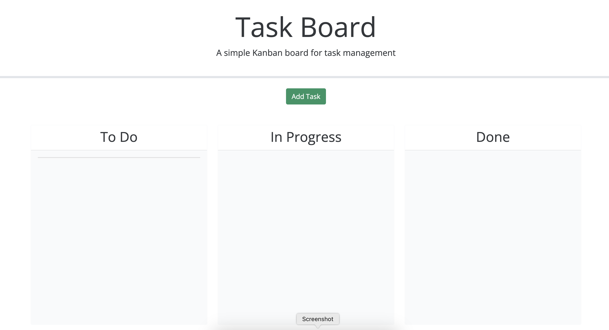
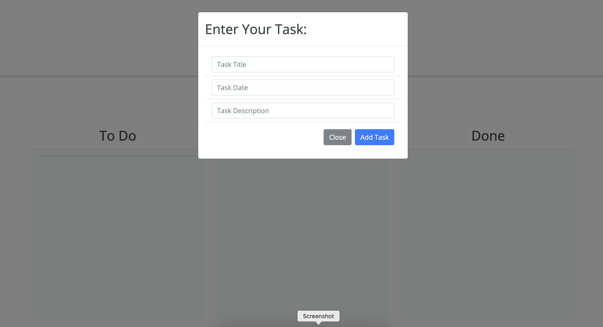
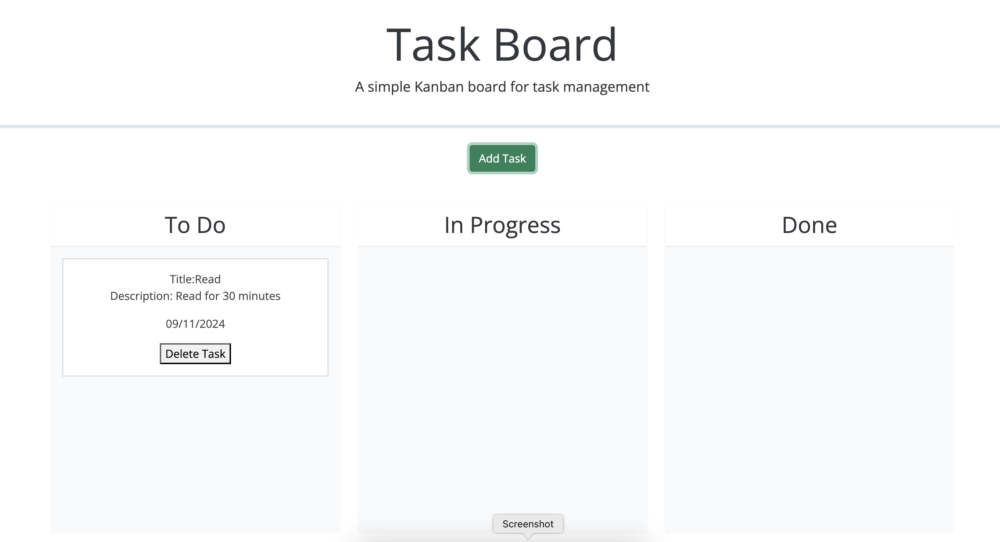

# Five-Task-Board

## My Task
Create a simple taskboard application that allows a team to manage projects task 
by modifing starter code. This app will run in browers and feature dynamically updated HTML,CSS powered by JQuery.

## User Story 

* As a project team member with multiple task to organize 
they WANT a task board. 

* So THAT they can add individual project task, manage their state if progress and track overall project progress accordingly.

## How to Use it 
When you open Task Board, there will be a green button labeled " Add Task "  

When button is clicked you will be prompted with "Task Title" , "Task Date", Task Description  

 
Once user fills out input, tasks will appear in the To Do Column, where user will be able to drag them to its correct column
 
 

## References
* https://api.jqueryui.com/droppable/
* https://jqueryui.com/

